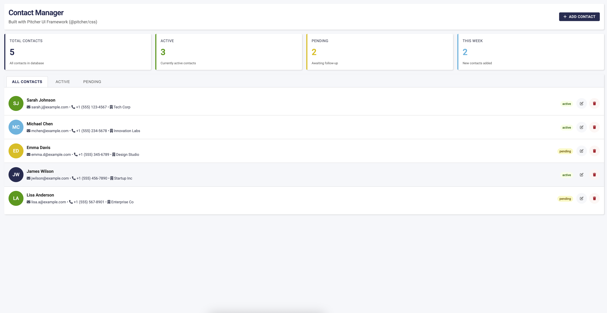

# Pitcher UI Demo - Contact Manager

A comprehensive demo application showcasing the **Pitcher UI Framework** (`@pitcher/css`) with a fully functional contact management interface.



## Overview

This demo app demonstrates how to build modern, responsive Pitcher embedded apps using the Pitcher UI Framework. It includes:

- **Real-world application**: A functional contact manager with CRUD operations
- **Component showcase**: Demonstrates cards, modals, forms, tabs, badges, buttons, and more
- **Instance theming**: Automatically adapts to your Pitcher instance color
- **Pitcher API integration**: Uses toast notifications and environment detection
- **Best practices**: Shows proper initialization, error handling, and admin context detection

## Features

### UI Components Used

- **Stats Dashboard**: Grid layout with colored stat cards
- **Tabs**: Interactive tab navigation between All/Active/Pending contacts
- **Modal**: Form modal for adding new contacts
- **Avatars**: Dynamic avatar generation with initials
- **Badges**: Status indicators (Active/Pending)
- **Buttons**: Primary, secondary, small, and icon buttons
- **Forms**: Complete form with inputs, selects, and labels
- **Cards**: Modern card-based layout
- **Icons**: Font Awesome integration

### Functionality

- View all contacts with detailed information
- Add new contacts via modal form
- Delete contacts with confirmation
- Filter contacts by status (tabs)
- Real-time statistics dashboard
- Toast notifications for user feedback
- Responsive design

## Installation

### Method 1: Using Pitcher CLI

```bash
cd ~/code/pitcher/pitcher-app-tutorials/pitcher-ui-demo
pit app publish --api-url https://dev.my.pitcher.com/api/v1
```

### Method 2: Using bash_profile Function

```bash
cd ~/code/pitcher/pitcher-app-tutorials/pitcher-ui-demo
source ~/.bash_profile && publish_pitcher_app
```

## File Structure

```
pitcher-ui-demo/
├── app.json             # App configuration

├── index.html           # Main application file
└── README.md            # This file
```

## Code Highlights

### Instance Color Theming

```javascript
async function applyInstanceColor() {
  if (window.parent?.jsApiLocation === 'admin') {
    return; // Skip in admin context
  }

  if (!api) return;

  const env = await api.getEnv();
  const instanceColor = env.pitcher?.instance?.color;

  if (instanceColor) {
    document.documentElement.style.setProperty('--p-primary', instanceColor);
  }
}
```

### Toast Notifications

```javascript
window.showToast = function(message, type = 'success') {
  if (api && api.toast) {
    api.toast({ message, type });
  }
};
```

### Tab Switching

```javascript
function initializeTabs() {
  const tabs = document.querySelectorAll('.p-tab[data-tab]');
  const tabContents = document.querySelectorAll('.p-tab-content[data-tab-content]');

  tabs.forEach(tab => {
    tab.addEventListener('click', () => {
      // Switch active tab and content
    });
  });
}
```

## Customization

### Adding New Fields

To add new contact fields, update the modal form and contact data structure:

```html
<!-- In modal body -->
<div class="p-form-group">
  <label class="p-label">New Field</label>
  <input type="text" class="p-input" id="contactNewField">
</div>
```

```javascript
// In contacts data
{ id: 1, name: 'John', email: 'john@example.com', newField: 'value' }
```

### Changing Colors

The app uses CSS variables for easy theming:

```css
:root {
  --p-primary: #29335C;      /* Main brand color */
  --p-success: #57A40F;      /* Success states */
  --p-error: #BC1637;        /* Error states */
  --p-warning: #E5C302;      /* Warning states */
  --p-info: #5BBFE3;         /* Info states */
}
```

### Adding New Tabs

```html
<!-- Add tab button -->
<button class="p-tab" data-tab="archived">Archived</button>

<!-- Add tab content -->
<div class="p-tab-content" data-tab-content="archived" style="display: none;">
  <!-- Your content here -->
</div>
```

## Development Tips

### Local Development

For local development, you can reference the CSS locally:

```html
<!-- Change from CDN -->
<link rel="stylesheet" href="https://cdn.jsdelivr.net/npm/@pitcher/css">

<!-- To local file -->
<link rel="stylesheet" href="pitcher-ui.css">
```

### Debugging

The app includes console logging for key events:

- Instance color application
- Tab initialization
- API availability
- Contact operations

Open browser DevTools to see these logs.

### Testing in Browser

You can open `index.html` directly in a browser to test the UI. Note that Pitcher API features (instance colors, toast notifications) will only work when embedded in Pitcher.

## Component Reference

All components used in this app are documented in the Pitcher UI Framework:

- **Documentation**: See `index.html` in `@pitcher/css` package
- **NPM Package**: `@pitcher/css`
- **CDN**: `https://cdn.jsdelivr.net/npm/@pitcher/css`

## Learn More

- **Pitcher JS API**: `@pitcher/js-api`
- **Pitcher Embedded Apps Guide**: See main repository README
- **More Examples**: Check other apps in `pitcher-app-tutorials/`

## Support

For issues or questions about:
- **The UI Framework**: Check `@pitcher/css` documentation
- **This demo app**: See code comments in `index.html`
- **Pitcher Platform**: Refer to Pitcher documentation

## License

MIT
